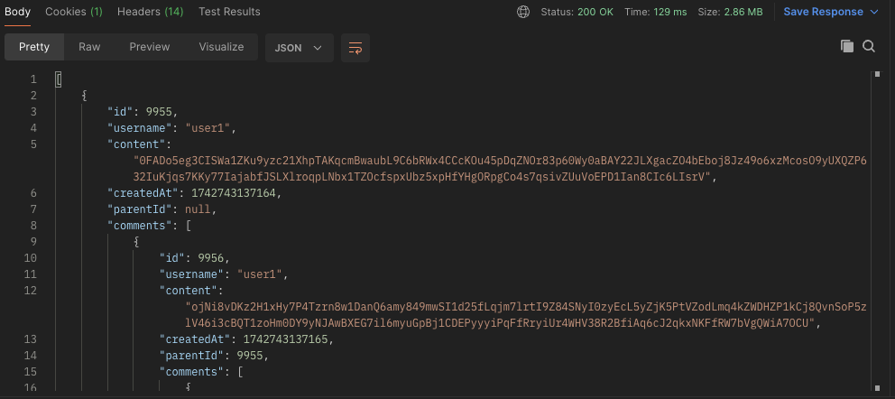
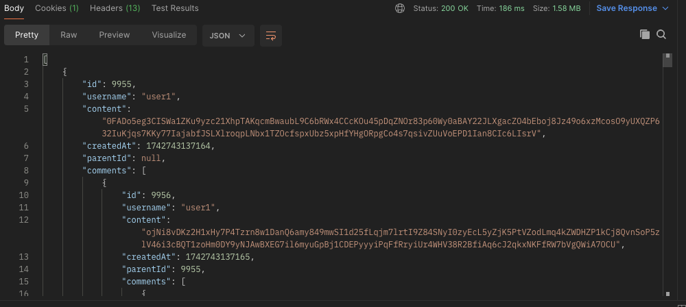
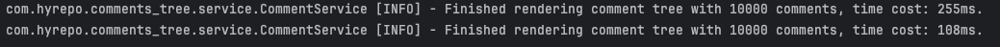

# Comment Tree

## 简介

本项目是一个简单的“树形留言”网站的实现（类似Reddit），支持登录、注册、注销，留言查看、新增、回复的功能。主要的技术挑战来自该网站可以支持无限层级的回复而不出现严重的性能问题。

## 如何运行

在根目录下执行以下命令即可运行起整个项目，前端网站会自动打开，也可以手动访问 http://localhost:3000/

```sh
./chmod +x run.sh
```

## 如何测试

### 单元测试

在`/backend`目录下运行以下命令，即可执行所有的单元测试、测试覆盖率检查、代码风格检查，检查报告的链接会在控制台里输出。

```sh
./gradlew clean build
```

### 手动测试

在项目运行起来后，可以访问 http://localhost:8080/swagger-ui/index.html#/ 来获取和测试所有API。

为了便于测试项目在大数据量下的表现，提供了一个API用于批量创建留言，该接口可直接调用，内部会完成用户注册等功能，
不带参数默认会创建100条深度为100层的留言（10000条）。可以通过Swagger或是以下命令运行：
```shell
curl --request POST 'localhost:8080/tests/comments?topLevelCommentCount=100&depth=100'
```

## 细节介绍

### 工程实践
该项目采用了一些工程实践来保证代码质量和提升效率，包括但是不限于
- 测试驱动开发。项目后端大部分代码采用测试驱动开发完成，业务逻辑测试覆盖率达到100%。
- 集成Jacoco进行测试覆盖率检查。目前设置的标准是100%，测试覆盖率不够会导致build失败。
- 集成Checkstyle进行代码风格检查，便于团队统一代码风格。如果有严重的代码风格问题build会失败，同时也会输出警告。

### 性能优化思路
该项目的一个难点在于留言的层数可以无限制，因此留言数据量变大之后可能会对性能产生一些影响，比如数据库的更新、网络的传输等耗时都可能会显著增加。

进行性能优化之前首先需要能够对性能进行测量，因此提供了一个名为`CommentIPerformanceTest`的性能测试，可以手动运行来测量目前的性能。

在这之后针对性能做了一些优化，在10000条评论（100条，每条100层嵌套），数据库为SQLite，机器为MacbookPro M1的情况下，**后端响应时间基本都能保持在300ms内**。

主要从以下三个方面进行了优化:
- 数据库设计
- 响应压缩
- 数据预热

#### 数据库设计

在设计数据库时，需要综合考虑对无限层级回复的支持、性能、使用便捷程度等因素。因为所有的评论在返回时本质的数据结构是一棵JSON树，因此首先考虑的是使用MongoDB来做存储，但是分析后发现无法满足对无限层级回复的支持。
下一步是考虑使用关系型数据库+父子关系模型，即每条评论有一个`parent_id`字段，指向自己的父评论，分析后发现可能存在性能问题。
最后考虑的是闭包表模型，即用一张表存储所有评论，再用另外一张表来存储所有路径，具体的分析如下：

| **模型**         | **优点**                         | **缺点**                                                |
|----------------|--------------------------------|-------------------------------------------------------|
| MongoDB的JSON模型 | 读取整个评论树非常快速方便（所有子评论都存储在同一个文档中） | 对单个文档的层级和大小都有限制（最深100层，最大16MB）。部分修改困难，修改某个子评论需要更新整棵树。 |
| 关系型数据库+父子关系模型  | 结构简单，增删改查易理解，可存储无限层级           | 深层查询性能差，需要递归查询多次数据库。如果未来有删除评论的需求，删除顶层评论需要大量请求数据库。     |
| 关系型数据库+闭包表模型   | 查询完整树极快，可存储无限层级                | 结构复杂，有理解成本。写入、更新、删除操作成本略高。                            |

最终决定使用**关系型数据库+闭包表模型**结构，基于以下几点考虑：
- 该模型在支持无限层级存储的前提还能最大程度的保证查询性能。
- 一般读取的需求会远大于写入的需求，它写入成本高的问题目前可以接受。
- 未来如果有对评论有更灵活的需求，比如删改或是查询指定层数，该模型也能很好支持。

#### 响应压缩

前端需要后端一次性返回所有评论，当有大量评论时，响应体的大小带来的网络传输成本就会变得越来越明显，因此该项目对响应进行了`GZP压缩`，在有10000条200个字符的评论时，开启后响应体的体积从2.86M降低到了1.58M（降低了约45%）。

压缩前



压缩后



#### 数据预热
当项目刚启动时，数据库的缓存为空，第一个请求将会直接访问硬盘，因此响应速度明显比后续的同样请求慢，所以在启动脚本里加入了如下代码，在后端服务运行起来后先发送一个获取所有的评论的请求来预热数据，然后再启动前端：
```shell
until curl -s http://localhost:8080/comments | grep -q "\["; do
  sleep 2
  echo "Waiting..."
done
```
可以看到，经过预热之后前端的第一个请求耗时显著降低：



#### 后续优化思路

对于100条100层嵌套评论的数据量目前延迟属于可以接受的地步，如果有更大的数据量需求，后续可以考虑使用缓存，将所有评论缓存起来，定期或者对评论进行增删改的时候主动更新缓存。

### 鉴权方式

项目的鉴权集成了Spring Security和JWT，同时实现了对JWT主动过期的支持，整体的实现方式如下：
- 当用户注册时，用`BCryptPasswordEncoder`加密密码后存储。
- 当用户登录时，手动调用Spring Security验证用户名和密码，而Spring Security又调用`UserService`和`BCryptPasswordEncoder`来比对用户的相关信息。
- 登录成功后，系统会生成JWT，保存进数据库，然后返回。
- 注销时，删除数据库的JWT记录来实现主动失效。
- 访问受限资源时，`JwtFilter`会校验HTTP header里的JWT，看是否合法和过期，同时还会检查数据库里有无此记录。

## 技术栈

- **前端:** jQuery, Vite
- **后端:** Java17, Spring Boot, Spring Data JPA
- **鉴权:** Spring Security, JWT
- **数据库:** SQLite, H2(测试)
